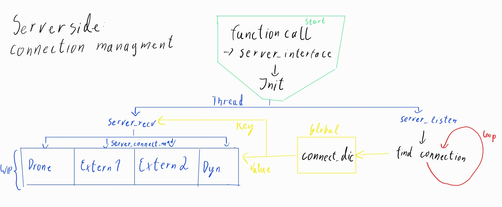
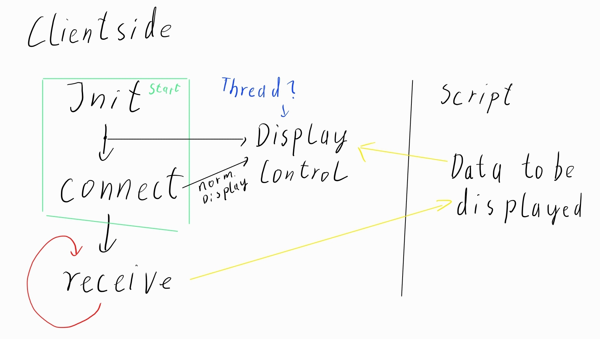

# Interface Management

Diese Beschreibungen dienen als Leitfaden für die Entwicklung und kontinuierliche Dokumentation des aktuellen Standes der Schnittstelle. Einwände und Ideen sind natürlich willkommen.

Da von der Serverside aus mehrere Verbindungen möglich sind muss der Zugriff innerhalb der Threads Kollisionsfrei verlaufen. Geplant ist dafür die Function "threading.lock" und dessen Komplimentärfunktionen. Die Umsetzung dieser muss aber noch im Detail ermitttelt werden. Bis jetzt ist geplant das diese Bedingungen über "with" abgerufen.

### Setup

Der Aufbau des System besteht aus zwei Hauptcomputern. Der Computer von Wohninvest, welcher im folgenden als Server bezeichnet wird, und der Computer von AuVARes welcher als Client oder Drohnen Client bezeichnet wird. Es werden Optionen offen gehalten für einen dritten Computer und/oder einer externen Quelle zur Überwachung des Systems. Der Server ist der Ansprechpatner aller Clients und ist als notwendige Hardware des Kickers von Wohninvest zu betrachten.

### Schnittstelle

Innerhalb aller beteiligten Teilnehmer des lokalen Netzwerkes soll zur erfolgreichen Verbindung eine "..._interface()" Funktion vorhanden sein. Im Falle des Servers liegt die Funktion "server_interface" vor. Der Drohnen Client hat die Funktion "network_connection" dafür vorgesehen. Diese Funktion dient dazu die Verbindung zu einem Verbindungspartner aufzubauen, zu organisieren und zu empfangen.

Die Sende Funktionen werden dort abgerufen wo sie erzeugt werden und werden vorgegeben. Progammierung steht aber noch aus.

##### Schnittstelle von Serverside

Im Falle des Servers werden die "Connection_type_objects" organisiert in dem Dictionary "connect_dic" hinterlegt. Diese "Connection_type_objects" enstehen aus der "socket_object.accept()" Funktion und beschreiben eine Verbindung von dem Server zu einem Client. Die Funktion "server_listen()" sucht kontinuierlich nach neuen Verbindungen und sotiert diese in "connect_dic". Bis zu vier Verbindungen können so erschaffen werden.

Zum empfangen von Informationen wird Funktion "server_recv" bzw. dessen Unterfunktion "server_connect_man()" genutzt. Ersteres erstellt Threads für alle möglichen Verbindungen. Die zweite Funktion übernimmt dann eine Verbindung innerhalb jedes Threads. Hier wird nun überprüft ob überhaupt eine Verbindung vorliegt, ob etwas gesendet wird und was gesendet wird. Für den Inhalt der Nachrichten werden die dokumentierten Befehle aus "network-communication-keywords.md" verwendet.

Geplant ist auch neben den bestehenden Befehlen Stand 03.05.2024 auch noch weiter Befehle hinzufügen welche die Verbindungen schließen, Verbidnungsart in "connect_dic" ändern etc. Dies steht aber nur als Idee und ist noch nicht festgelegt.

##### Schnittstelle von Clientside

Der Dronen Client wird innerhalb des Netzwerkes nur Verbindung zu dem Server aufnehemen. Es ist somit nicht nötig meherere Verbindungen zu unterstützen. Die Funktionen der Schnittstelle werden also dadurch gesteuert das es überhaupt erst zu einer Verbindung kommt. Solange keine Verbindung gefunden wird verbleibt die zuständige Funktion in einem Suchzustand.

Sobald eine Funktion gefunden ist muss die Funktion nur noch die Empfangenden Befehle managen. Dies erfolgt ebenfalls mit den dokumentierten Befehlen aus "network-communication-keywords.md".

Sobald ein Befehl erkannt wurde folgt eine entsprechende Reaktion. Nach Systemvorgabe ist es dabei nur nötig die Displays anzusprechen und die entsprechenden Informationen/Bilder etc. zu übertragen. Es muss somit im normalen Betrieb keine Interferenz mit der Steurung der Drohne erfolgen. Nur Start und Stop Bedingungen interferieren mit dem System. Während des normalen Betriebs muss somit nur Zugriff auf die nötigen Daten der Drohne (Videostream) gewährleistet sein.

### Senden von Befehlen

Funktion existiert noch nicht

Das senden von Befehlen wird vor Ort (wo die Bedingung erzeugt wird) geschehen. Dafür wird eine passende Funktion bereit gestellt welche sich über verschieden Parameter wie gewünscht einstellen lässt. Der zu sende Befehl wird als Argument in string in die Funktion eingesetzt und gesendet. Der gesendete Befehl wird von dem Empfänge interpretiert welcher dann wieder das entsprechende acknowledgement sendet. Wie lange auf das acknowledgement oder ob überhaupt gewartet wird ist variabel.

### Acknowledgement

Die Acknowledgements werden durch die dictionaries "ack_dic" und "ack_status_dic" gehandelt. Sobald ein Befehl/Keyword gesendet wird, wird das dazugehörige Value im "ack_status_dic" von None auf False gesetzt. Wenn das Acknowledgement empfangen wird und dessen status im "ack_status_dic" False ist so setzt die zuständige Empfangsfunktion das Value auf True. Sobald das Value auf True gesetzt wird, wird es in der ursprünglichen Sendefunktion wieder of None gesetzt und das Acknowledgment wird als angekommen gewertet.

## Offene Baustellen

- Grundlage für das desgin ist in Bearbeitung

- Aktive Überprüfung der Verbindung über ping abtausch

- Kollisionskontrolle ist in der Entwicklung

- Display Kontrolle ist noch unbekannt. Standard Ansteuerung über Website geplant.